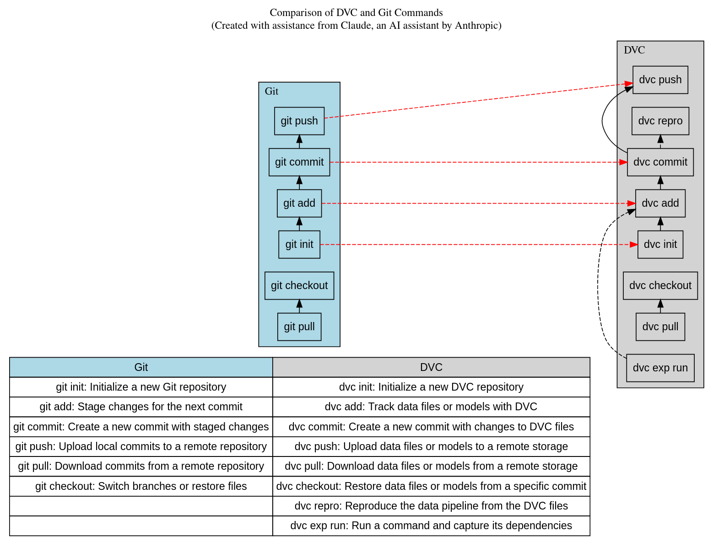

# Data Version Control for Data Science
This repository demonstrates how you can use data version control, which is a way to keep track of changes in various types of files generated during a data science project. Data science involves trying to understand and solve real-world problems by analyzing data, creating interactive reports, dashboards, and building machine learning models.

In a typical data science project, you may work with different types of files such as code files (e.g., Python scripts), data files (e.g., CSV, JSON), plots or visualizations (e.g., PNG, PDF), and machine learning metrics (e.g., accuracy, precision, recall). As you make changes to these files or generate new ones, it becomes challenging to keep track of all the versions and ensure reproducibility.

This is where version control systems like Git come into play. Git is a popular tool that allows you to track changes in your code files and collaborate with others. However, Git is not designed to efficiently handle large binary files like data files or visualizations, which can quickly consume a lot of space in your version control repository.

Data version control tools like DVC (Data Version Control) and Makefiles can help solve this problem. DVC is a tool that helps you track and manage changes in your data files, plots, and machine learning metrics, while keeping the actual data outside of your Git repository. Makefiles are files that define a set of instructions (or rules) for building and managing a project's files and dependencies.

In this repository, we will explore how to use DVC and Makefiles together to create reproducible and easy-to-share workflows for data science projects, competitive data science challenges, and even generative AI ambitions. By using these tools, you can ensure that your work is reproducible, sharable, and easily manageable, even when dealing with large data files or complex experiments.   

> You'll need to make an account and application [here](https://africastalking.com/) -- [tutorial](https://youtu.be/KZrPWw3Dt70?si=VrLmWGtPC0UAofwi), export the username, Phone number and API KEY as environment variables. In addition, setting up the [kaggle CLI](https://medium.com/@c.venkataramanan1/setting-up-kaggle-api-in-linux-b05332cde53a)    

> Note: This repository is intended for educational purposes and serves as a starting point for learning about data version control and Makefiles in data science projects. It is not meant to be a comprehensive guide, but rather a practical demonstration of how these tools can be used in practice.       

> The makefile present in main folder is to make Quarto .qmd files in .html files provided.    

## TL;DR    
   

## Installation

1. Install Quarto by following the instructions on the [Quarto website](https://quarto.org/docs/get-started/). Quarto is available for Windows, macOS, and Linux.

2. Install a code editor or integrated development environment (IDE) of your choice. Some popular options for data science include:
   - [Visual Studio Code](https://code.visualstudio.com/) (with the [Quarto extension](https://marketplace.visualstudio.com/items?itemName=quarto.quarto))
   - [RStudio](https://posit.co/downloads/) (with the [Quarto pane](https://quarto.org/docs/tools/rstudio.html))
   - [Jupyter Lab](https://jupyter.org/install) (with the [Quarto extension](https://quarto.org/docs/tools/jupyter-lab.html))

3. Install the [anaconda](https://docs.anaconda.com/free/anaconda/install/index.html) or [miniconda](https://docs.anaconda.com/free/miniconda/miniconda-install/) if you don't have enough space for the other one. This is a software that helps you manage your virtual environments for Python, R, Julia as well as the packages they have. We recommend Py312 for this.    

## Usage

This repository contains two folders:

1. [Makefile ML](datavc_makefile/README.md): This folder demonstrates how to use Makefiles for automating and managing the dependencies in a data science project. Makefiles define a set of rules and instructions for building and processing various files in the correct order.

2. [Makefile & DVC](datavc_full/README.md): This folder demonstrates the combined usage of Makefiles and Data Version Control (DVC). DVC is a tool that helps track changes in data files, plots, machine learning models, and metrics, ensuring reproducibility and shareability of your data science workflows.

To get started, navigate to the desired folder (`datavc_makefile` or `datavc_full`) and follow the instructions provided in the respective README file. These folders contain examples and demonstrations of how to use Makefiles and DVC in practice.   

You can also try using the models stored in the repo using the documentation [here](https://mlem.ai/doc/user-guide/serving).    

## Folder structure   
.   
├── codegotllama.txt - # a suggestion of how to organise a Makefile with LLAMA3 8B  
├── datavc_full - # data version control with a Makefile and DVC  
│   ├── activate_venv.sh  
│   ├── cleandata.py  
│   ├── dvc.lock  
│   ├── dvc.yaml  
│   ├── eda.py  
│   ├── evaluate.py   
│   ├── import_data.sh   
|   ├── .kaggle - # a folder for kaggle API key not included in the repository
│   ├── Makefile  
|   ├── send_sms.py      
│   ├── params.yaml   
│   ├── README.md   
│   ├── requirements.txt   
│   └── split_data.py   
├── datavc_makefile - # data version control with a Makefile only    
│   ├── activate_venv.sh  
│   ├── cleandata.py  
│   ├── Dockerfile  
│   ├── eda.py  
│   ├── evaluate.py   
│   ├── import_data.sh   
|   ├── .kaggle - # a folder for kaggle API key not included in the repository
│   ├── Makefile   
|   ├── send_sms.py    
│   ├── README.md   
│   ├── requirements.txt   
│   └── split_data.py   
├── data_version_control_presentation.html - # a summarized form of presentation in html (download and open in browser)   
├── data_version_control_presentation.qmd - # a quarto version of the document   
├── eda-regression.ipynb - # a notebook that I used from kaggle   
├── LICENSE - # License information    
├── Makefile - # a tool to shorten commands   
├── README.md - # the current file you are reading   
├── requirements.txt - # Python packages for quarto rendering    
├── Screenshot from 2023-02-13-10-57-10.png - # a photo used throughout the presentation see references.    
└── Screenshot from 2023-02-13-10-57-41.png - # a photo used throughout the presentation see references.  
├── graphviz-git-dvc.dot - # a graphviz file for the git and dvc flow. Use <https://dreampuf.github.io/GraphvizOnline/> to view and edit.   
├── graphviz-git-dvc.png - # a png file of the graphviz-git-dvc.dot.     
├── graphviz-makefile-flow.dot - # a graphviz file for the makefile flow. Use <https://dreampuf.github.io/GraphvizOnline/> to view and edit.   
├── graphviz-makefile-flow.png - # a png file of the graphviz-makefile-flow.dot.  
└── graphviz-git-dvc.dot - # a graphviz file for the git and dvc flow. Use <https://dreampuf.github.io/GraphvizOnline/> to view and edit.     

## Contributing

Contributions to this repository are welcome! If you'd like to contribute, please follow these steps:

1. Fork this repository to your GitHub account.   
2. Create a new branch for your changes: `git checkout -b my-new-feature`  
3. Make your desired changes to the codebase or documentation.  
4. Commit your changes: `git commit -am 'Add some feature'`   
5. Push the branch to your forked repository: `git push origin my-new-feature`   
6. Create a new Pull Request on the original repository, describing your changes in detail.     

We encourage you to explore and experiment with different ideas, such as integrating object storage solutions like S3 or Google Cloud Storage for storing and managing data files or using Docker containers for reproducible environments.   

Don't forget to include emojis 🚀 and descriptive commit messages to make the process more enjoyable! 🎉   

## License   
This repository is licensed under the [Apache 2.0 License](https://www.apache.org/licenses/LICENSE-2.0).   

## References   
1.DVC documentation: <https://dvc.org/doc>   
2.DVC YouTube channel: <https://www.youtube.com/playlist?list=PL7WG7YrwYcnDb0qdPl9-KEStsL-3oaEjg>   
3.Pragmatic AI labs: <https://youtu.be/rKRG6oQf-bQ?si=4BzXMhS7owl6uWef>    
4.Kaggle notebook by Dandelion: <https://www.kaggle.com/code/hely333/eda-regression>     
5.Predicting Chronic kidney Disease: <https://github.com/Shuyib/chronic-kidney-disease-kaggle>   
6.Sparklyr course: <https://www.datacamp.com/courses/introduction-to-spark-with-sparklyr-in-r>
